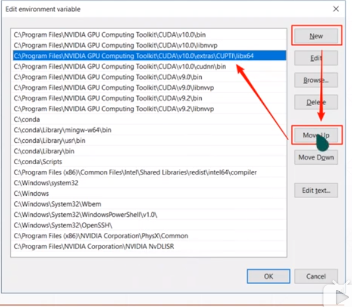

# Tensorflow环境安装

## Windows安装

### 一、安装Anaconda

1. 点击[这里](https://www.anaconda.com/distribution/)下载Anaconda进行安装，跟普通软件一下双击打开安装即可。

2. 安装时候勾选该项：

   

3. 验证：在cmd窗口输入**conda list**

### 二、安装CUDA

1. 点击[这里](https://developer.nvidia.com/cuda-10.0-download-archive?target_os=Windows&target_arch=x86_64&target_version=10&target_type=exelocal)下载CUDA10版本，下载后跟普通软件一样双击打开安装。

2. 安装时候选择自定义安装避免报错：

   

   去掉如下图的选项：

   

   

   对于显卡驱动，win系统会安装显卡驱动，而CUDA也带有显卡驱动，此时需要保证的是：如果电脑安装的显卡驱动版本要高于CUDA自带的显卡驱动，则**不需要选中下面选项**：

   

3. 验证：查看是否存在该文件
   
   
   
   

### 三、安装cuDNN

1. 点击[这里](https://developer.nvidia.com/rdp/cudnn-archive)下载跟CUDA**同版本**的cuDNN

2. cuDNN不是应用软件，直接解压复制到CUDA安装文件夹即可。
    

3. 验证：该文件目录下存在该文件：

   

   

### 四、PATH配置

1. 在环境变量中做如下改变：

   

   

   

2. 确认：

   

### 五、测试CUDA

1. 在cmd中执行：nvcc -v

   

### 六、Tensorflow安装

1. 目前Tensorflow提供1.x和2.0版本：


2. 去py文件中执行：

   ```python
   import tensorflow as tf
   
   # 查看tf的版本号
   print(tf.__version__)
   # 测试gpu版本是否可用
   print(tf.test.is_gpu_available())
   #输出True说明gpu正常
   ```

   

## Linux安装

视频教程：[点击查看](https://www.bilibili.com/video/av65509202/?p=7)

### 一、安装Anaconda

1. 点击[这里](https://www.anaconda.com/distribution/)下载Anaconda进行安装

### 二、安装CUDA

1. 点击[这里](https://developer.nvidia.com/cuda-10.0-download-archive?target_os=Linux&target_arch=x86_64&target_distro=Ubuntu&target_version=1804&target_type=deblocal)下载Ubuntu18.04的CUDA10.0版本。

2. 安装方式：

   ```shell
   `sudo dpkg -i cuda-repo-ubuntu1804-10-0-local-10.0.130-410.48_1.0-1_amd64.deb`
   `sudo apt-key add /var/cuda-repo-<version>/7fa2af80.pub`
   `sudo apt-get update`
   `sudo apt-get install cuda`
   ```

   

### 三、安装cuDNN

1. 点击[这里](https://developer.nvidia.com/rdp/cudnn-archive)下载跟CUDA**同版本**的cuDNN
2. 解压

### 四、PATH配置

增加一个环境配置文件，执行**echo $LD_LIBRARY_PATH**

使用**vi ~/.bashrc**打开编辑:

1. 末尾增加export PATH="/usr/local/cuda-10.0/bin:$PATH"
2. 末尾增加export LD_LIBRARY_PATH="你的cudnn目录/lib64:$LD_LIBRARY_PATH"

保存退出值后，使用**source ~/.bashrc**刷新。

### 五、测试CUDA

1. 使用nvidia-smi查看显卡信息
2. 使用nvcc -v查看CUDA版本信息