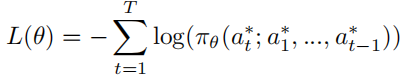

# 视频描述（Video Caption）近年重要论文总结

## 视频描述

顾名思义视频描述是计算机对视频生成一段描述，如图所示，这张图片选取了一段视频的两帧，针对它的描述是"A man is doing stunts on his bike"，这对在线的视频的检索等有很大帮助。近几年图像描述的发展也让人们思考对视频生成描述，但不同于图像这种静态的空间信息，视频除了空间信息还包括时序信息，同时还有声音信息，这就表示一段视频比图像包含的信息更多，同时要求提取的特征也就更多，这对生成一段准确的描述是重大的挑战。

### 一、long-term Recurrent Convolutional Networks for Visual Recognition and Description --- 2015.2.17

1. 在本文中提出了Long-term Recurrent Convolutional Network (LRCN)模型，包含了一个特征提取器（例如CNN），以及时序学习器，该模型不是专门用于视频描述的，该文章使用该模型的三种类型用在不同的任务上面。
2. 帧画面通过特征变换参数（特征提取器）得到一个固定长度向量来表示该帧画面的特征，在得到帧画面的特征值后输入到序列模型（例如LSTMs），然后经过softmax进行选词：

3. 该模型可以适应多种模式：

   

   1. Sequential inputs, fifixed outputs： many-to-one的模型，实现方式是对于序列模型，在最后步骤合并之前步长所学习到的特征成为一个总的特征y，这样就得到了一个输出。
   2. Fixed inputs, sequential outputs： one-to-many的模型，实现方式是在所有序列模型的输入步长都使用同一个x，由于个步长都会得到一个输出，因此得到了一个序列的输出。
   3. Sequential inputs and outputs： many-to-many的模型，实现方式是采用encoder-decoder的方法，在encoder的时候，每个步骤依次输入不同的x，最终encoder会的到一个固定长度的向量，然后输入到decoder中，产生不固定长度的输出。

4. 训练方法：

   1. 使用随机梯度下降方法对模型进行训练，使输出y落在真实单词位置的可能性最大，也就是最大似然方法。
   2. 采用交叉熵公式：
   3. 使用负对数的方法，变成最小化问题。

5. 指标：

   1. **Activity recognition**

   2. **Image description**

   3. **Video description**：

      在视频描述方面使用了模型如下：

      

      主要在LSTM之前使用了CRF对视频进行处理，得到如下评估数据（BLEU4）：

      

      

### 二、Translating Videos to Natural Language Using Deep Recurrent Neural Networks --- 2015.4.30

#### 模型介绍：

先对所有视频帧画面使用卷积神经网络进行图片特征提取，获取fc7层的特征向量（4096固定长度），然后将所有帧画面提取到的特征向量做meanpooling得到一个最终向量（类似图片描述中的输入向量）。在LSTMs网络中，每个步长都输入同样的向量，并在每个步长都得到LSTMs的一个输出作为当前输出单词的编码，直到输出结束符<EOS>为止。

在本文中提到，在Donahue et al. (2014)提出两层的LSTM比四层或者单层的LSTM效果好。

对于单词的处理方式：one-hot编码

#### 训练方法：

采用最大似然法，优化参数的值，来最大化生成正确句子的概率。 given the corresponding video *V* and the model parameters *θ*，对应的交叉熵公式：

上式是对于整个句子做交叉熵，在本文中还可以对每个单词做交叉熵后相加得到损失值：

对于将LSTM的输出映射到one-hot词库还是使用softmax函数：

#### 评估指标：

数据集使用：MSVD

指标：

在本文中去掉了mean pooling，直接输入单个帧特征到模型中，查看mean pooling的影响，最终效果：

相对没有mean pooling差。

#### 总结：

缺点：

1. 使用mean pooling对所有视频帧整合，丢失了视频序列上的部分信息。

### 三、Sequence to Sequence – Video to Text --- 2015.10.19

#### 模型介绍：

本文是早期经典文章，思路相对简单，如图所示，对视频的特征提取也仅仅对每帧的图像使用CNN网络进行2D特征的提取，同时加入了另外的特征——光流图像提取的特征，因为可以更好的表示视频中的动作，整个视频encoder和decoder过程在一个LSTM模型上完成，考虑到了视频的时序特征，因此使用LSTM网络来顺序进行图像特征的输入，用隐含层来表示整个视频，再接着输入单词来逐个预测单词，之后是详细介绍。

本文提出的模型，对于视频抽取帧画面之后，使用训练好的VGG16模型对帧画面进行特征提取，得到fc7层的输出向量（4096长度），然后按视频帧顺序依次输入到LSTMs网络中，在输入过程中不产生输出，做encoding操作，并将第一层得到的输出向量输入到第二层LSTM，当所有视频帧输入完毕，开始获取第二层LSTM的输出（也就是对应的描述句子单词），直到获得<eos>为止。

#### 训练方法：

采用最大似然法，优化参数的值，来最大化生成正确句子的概率，对于第二层LSTM的输出，经过softmax到one-hot词库中取词，并通过交叉熵的方式来计算误差值：

#### 评估指标：

使用视频数据集：MSVD

#### 总结：

由于是早期的文章，忽略了很多东西，比如在image caption中有显著贡献的attention机制，更好的时序特征提取技术，其他的特征比如语音、背景音等特征。可以说这篇文章极大的依赖LSTM网络本身的性质，时序特征也就是image feature之间的关联也靠模型自动学习，包括最终的视频特征和之后单词之间的关联也都靠LSTM模型自动学习，作者只加了一个光流图像特征进行加权平均。

### 四、**Video Paragraph Captioning Using Hierarchical Recurrent Neural Networks** --- 2016.4.6

#### 模型介绍：

1. 在之前的文章中都是生成一句话对视频描述。**在这篇文章中提出了生成对文章的长文本描述，包含多个句子的段落**，这就要求能对视频提取更详细的特征以及语句之间关系的学习。还有一点不同的是在训练的时候，句子也会作为训练数据输入到模型中学习语句之间的关系。

2. 整个模型分为句子生成器和段落生成器：

   1. **句子生成器：**对**一个句子所有单词**做embedding得到一个低维（512）的表示，按顺序输入到RNNⅠ（GRU，512）中，得到整个句子的表示*h*和最后的一个*state*，然后将*h*和所有视频帧画面的特征一起输入到两个Attention中，第一个Attention将视频特征v和h转换成低维表示（32到256长度），然后第二个Attention将其再压缩成一个标量来表示这一特征的权重，两个Attention公式如下：

   2. 然后将得到的所有特征对应的权重计算softmax：

      最后得到来作为每个特征的最终权重。

   3. 在 **weighted averaging**层（**temporal mean pooling**的复杂版本）使用下式计算特征总和：
   
   4. 以上到最终特征向量的获得，整个流程在模型中存在多个，也就是最后获得多个**u**来表示特征。每个特征通道通过学习不同的参数来学习特征的偏差值。在本文中使用两个通道，一个来提取视频的物体特征，一个来提取动作行为特征。
   
   5. **the multimodal layer：**将**weighted averaging**得到的**u**（两个通道就有两个u）以及RNNⅠ的**h**输入到multimodal layer得到一个1024维的表示：
   
      在此为了降低过拟合，使用了0.5比例的dropout。
   
      <u>要注意的是：在1中的式子是使用h的t-1时刻，在这里使用的是h的t时刻，初步判断是RNNⅠ的到的h的t-1时刻是整个句子的最后表示，输入到段落生成器后得到一个新的输入导致RNNⅠ往前又走了一步，所以这时候是h的t时刻。</u>
   
   6. 在5步得到1024维表示后，通过一个hidden层（512*N）得到一个与词库单词向量长度一样的输出，然后通过softmax做归一化，最后通过MaxID（在向量中最大的值）得到对应one-hot的单词。
   7. **段落生成器：**在RNNⅠ处理完**一个句子**的时候，段落生成器才开始计算。通过**embedding average**对当前句子单词做计算得到更紧凑的表示，以及处理完**一个句子**的RNNⅠ的最后状态state，作为句子的紧凑表示。
   8. 在**sentence Embedding**中将7中得到的两个表示连接在一起，得到一个完整的句子表示（512维），并将其输入到RNNⅡ（GRU）中。
   9. **paragraph state layer：**使用该单元将RNNⅡ的隐藏状态以及**sentence Embedding**得到的句子表示整合成一个最终的句子表示输入到RNNⅠ中作为其处理下一个句子的初始化隐藏状态。

#### 训练方法：

1. 本文用随机初始化的参数从零开始训练分层框架中的所有组件。
2. 本文利用时间反向传播(BPTT)[53]计算参数的梯度，用随机梯度下降(SGD)寻找最优解。
3. 为了更好地收敛，本文根据RMSPROP算法[44]将梯度除以其最近大小的运行平均值。为了避免RNN训练过程中常见的问题：梯度爆炸，我们设置了一个小的学习速率10E-4。
4. 生成单词的概率：

   输入包含视频特征，在此之前输入的句子，当前句子单词前的所有单词。

5. 句子生成损失函数：

   单词生成的损失之（交叉熵）之和除以句子的单词数量。

6. 段落生成损失函数：

   所有句子生成的损失值之和除以句子数量。

#### 评估指标：

1. 使用**YouTubeClips**训练集，该数据集由从youtube下载的1，967个短片(平均9秒)组成。

   

2. 使用**TACoS-MultiLevel**训练集：该数据集包含185段长视频(平均6分钟)，拍摄于室内环境。

   

#### 总结：

1. 比较之前提出了生成视频长句子描述的方案，对视频的特征提取需要更高的要求以及对段落生成的实现。
2. Attention不仅得到时间上的关系，还得到空间上的关系（本文还通过计算视频帧上不同位置的多图像块的特征来将空间注意力集中在一起，并将这些特征汇集在一起）。

### 五、Dense-Captioning Events in Videos --- 2017.5.2

#### 模型介绍：

#### 训练方法：

#### 评估指标：

#### 总结：

### 六、Video Captioning via Hierarchical Reinforcement Learning --- 2018.3.29

#### 模型介绍：

1. 遵循encoder-decoder框架，使用CNN加上RNN来对视频和语句信息进行encoder，使用HRL Agent来decoder。
2. 使用预训练好的CNN模型来加速训练，使用预训练好的Internal Critic模块。
3. 使用CNN对视频帧进行特征提取后给两层LSTM，分别产生h1和h2的输出。将h2和Attention的输出c2输入到Manager模块（RNN）产生gate值，将gate，Worker模块上一个输入a以及Attention（使用到h1）的输出c1输入到Worker模块来产生单词（一个gate值对应多个单词），产生单词的动作也叫action，将action输入到Environment来获得这次得到单词的奖励，同时也将action输入给Internal Critic模块来判断是否需要Manager模块给出新的gate信号以及是否达到了语句的结尾<EOS>。
4. 获得一个由Manager产生的gate信号，Worker会产生不定长的句子段落。

#### 训练方法：

1.  reinforcement learning agent在最开始的时候使用交叉熵来做最初策略：

   

   之后再使用6的方法。

2. 在增强学习中的Reward的给出由评估方法（CIDEr, BLEU or METEOR）给出，Worker模块本次生成的单词（action）的Reward由之前产生的单词加本次单词的CIDEr得分减去之前产生的单词CIDEr得分，具体公式：

   所以Worker得到的Reward是：

   

   而Manager得到的Reward是：

   

3. 训练Manager和Worker的时候是异步的：在训练Manager的时候固定Worker的参数，训练Worker的时候固定Manager的参数。

   

#### 评估指标：

1. 使用**MSR-VTT**数据集（10,000 video clips (6,513 for training, 497 for validation, and the remaining 2,990 for testing)：

   

2. 使用**Charades Captions** 数据集（ 9,848 videos of daily indoors activities）：

   

   

#### 总结：

1. 使用了增强学习来实现视频描述，实现长文本的描述，能描述长视频。

### 七、Move Forward and Tell: A Progressive Generator of Video Descriptions

#### 模型介绍：

1.  encoder-decoder的模型：
   1. 单纯的一个句子不足以描述含有复杂信息的视频。
2. 生成多句子模型：
   1. 句子之间缺乏连贯性和高度冗余。
   2. 原因：
      1. 无法将给定视频的时间结构与所生成的描述的叙事结构对齐
      2. 忽略句子之间的依存性
3. to do

#### 训练方法：

#### 评估指标：

#### 总结：